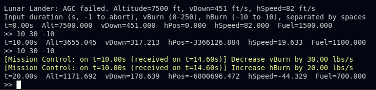

# Moon Lander Simulator: A Text-Based Ode to Apollo-Era Engineering

**Platforms:** Linux, Windows, macOS (Terminal/CLI)  
**Languages:** C, Python, Rust, BASIC (QB64, FreeBASIC)  
**GitHub:** [Source Code & Binaries](https://github.com/GeorgeMcGinn/MoonLander)



---

## About the Game

This open-source terminal game drops you into the boots of an Apollo astronaut during a lunar landing emergency. When the Apollo Guidance Computer (AGC) fails at 7,500 feet, you must manually guide the Lunar Module (LEM) to safety using:

- Real lunar gravity (5.33136483 ft/s²)
- Historically accurate fuel loads
- Runge-Kutta 4th Order (RK4) physics
- Mission Control's delayed feedback system


Available in **C, Python, Rust, and BASIC (QB64, and FreeBASIC)**, it runs in any terminal emulator.

---

## Installation & Compilation

The game has been written to run in Linux, Windows and macOS in a variety of languages. The source code is provided so you can install and compile the game on your machine. Source code will compile in C, C++, QB64 (including Phoenix Edition) and FreeBASIC.

Below are links to documents on how to install and/or compile the source code:

- **[Python Install/Execution](documents/Apollo_Lunar_Lander_Simulator-Python.md)**
- **[C/C++ Install/Execution](documents/Apollo_Lunar_Lander_Simulator-C.md)**
- **[QB64 Install/Execution](documents/Apollo_Lunar_Lander_Simulator-QB64.md)**
- **[FreeBASIC Install/Execution](documents/Apollo_Lunar_Lander_Simulator-FreeBASIC.md)**
- **[Rust Install/Execution](documents/Apollo_Lunar_Lander_Simulator-Rust.md)**

Pre-built binaries are available for Linux (Debian/RPM) and Windows. QB64 fans can run the `.bas` file directly in that environment.

---

## How to Play

### Starting Conditions

| Parameter         | Value           |
|-------------------|-----------------|
| Altitude          | 7,500 ft        |
| Vertical Speed    | 200-700 ft/s ↓  |
| Horizontal Speed  | 50-200 ft/s →   |
| Descent Fuel      | 1,500 lbs       |


### Player Input and Control

Players control the LEM by inputting:

- **Duration**: Burn time in seconds (positive values; -1 to abort).
- **Vertical Burn Rate ($vBurn$)**: Fuel consumption rate for descent (0 to 250 lb/s).
- **Horizontal Burn Rate ($hBurn$)**: Lateral thrust (-10 to 10 lb/s).

The simulation processes these inputs over small 0.1-second increments, updating the LEM’s state. Real-time feedback from "Mission Control" suggests optimal burn rates, enhancing the manual control experience.

Here are separate documents on how to play and a sample strategy:
- **[How To Play](documents/How_to_Play.md)**
- **[Sample Strategy for Moon Lander Simulation Game](documents/Sample_Strategy.md)**

---

### Input Format

```
Duration (seconds) [vBurn] [hBurn]
Example: 5 150 -3 → 5s burn at 150 lb/s vertical, -3 lb/s horizontal:

Lunar Lander: AGC failed. Altitude=7500 ft, vDown=451 ft/s, hSpeed=82 ft/s
Input duration (s, -1 to abort), vBurn (0-250), hBurn (-10 to 10), separated by spaces
t=0.00s  Alt=7500.000  vDown=451.000  hPos=0.000  hSpeed=82.000  Fuel=1500.000
>> 5 150 -3
```

Mission Control provides delayed feedback (4.6s signal+processing time) suggesting adjustments:

```
[Mission Control: on t=10.00s (received on t=14.60s)] Decrease vBurn by 30.00 lbs/s
[Mission Control: on t=10.00s (received on t=14.60s)] Increase hBurn by 20.00 lbs/s
```
---

## The Physics Behind the Madness

This isn't arcade physics - it's a love letter to 1960s aerospace engineering:

### Key Equations

- **Thrust Acceleration:** \( a = \frac{\dot{m} V_{ex}}{m} \)
- **Fuel Consumption:** \( \Delta m = (\text{vBurn} + |\text{hBurn}|) \times \Delta t \)
- **RK4 Integration:** 4th-order method for position/velocity updates

The code implements this through (Example in C):

```c
// From moonLander.c
double thrustAcc_vertical = (vBurn / 32.174) * 10000 / mass_slugs;
double netAcc = 5.33136483 - thrustAcc_vertical;
```

### Realism vs Apollo

| Feature               | Game            | Real Apollo        |
|-----------------------|-----------------|--------------------|
| Integration Method    | RK4 (4th order) | Heun's (2nd order) |
| Time Step             | 0.1s            | 0.5s               |
| Vertical Speed @7500ft| 200-700 ft/s    | 50-100 ft/s        |


### The 4.6-Second Lag: A Nod to History

The game enforces a 4.6-second delay (2.6s for Earth-Moon signal travel + 2s processing), mimicking Apollo's communication limits and forcing players to rely on predictive thinking. Here's how it compares to the real Apollo missions:

|Component 	                      | Real Apollo 	 | Game Simulation |
|---------------------------------|----------------|-----------------|
|Signal travel time (Earth-Moon) 	| 2.6 seconds 	 | 2.6 seconds     |
|Mission Control processing 	    | 4-6 seconds 	 | 2 seconds       |
|Total feedback delay 	          |6.6-8.6 seconds |	4.6 seconds    |

This delay was a balancing act during development—long enough to feel authentic, but short enough to keep the game engaging. Testing it myself, I found the lag forced me to think ahead, adding tension that mirrored the Apollo missions.

Below is an example of the RK4 integration (C & PYTHON examples). There is also a corresponding routine for rk4_horizontal:

**RK4 integration snippet from moonLander.c**

```c
void rk4_vertical(double *altitude, double *vDown, double dt, double netAcc) {
    double k1[2], k2[2], k3[2], k4[2];
    double temp_state[2];
    double state[2] = {*altitude, *vDown};

    compute_vertical_derivatives(state, k1, netAcc);
    temp_state[0] = state[0] + 0.5 * dt * k1[0];
    temp_state[1] = state[1] + 0.5 * dt * k1[1];
    compute_vertical_derivatives(temp_state, k2, netAcc);
    temp_state[0] = state[0] + 0.5 * dt * k2[0];
    temp_state[1] = state[1] + 0.5 * dt * k2[1];
    compute_vertical_derivatives(temp_state, k3, netAcc);
    temp_state[0] = state[0] + dt * k3[0];
    temp_state[1] = state[1] + dt * k3[1];
    compute_vertical_derivatives(temp_state, k4, netAcc);

    *altitude += (k1[0] + 2*k2[0] + 2*k3[0] + k4[0]) * dt / 6.0;
    *vDown += (k1[1] + 2*k2[1] + 2*k3[1] + k4[1]) * dt / 6.0;
```

**RK4 integration snippet from moonLander.py**

```PYTHON
def rk4_vertical(altitude, vDown, dt, netAcc):
    state = [altitude, vDown]
    k1 = compute_vertical_derivatives(state, netAcc)
    temp_state = [state[0] + 0.5 * dt * k1[0], state[1] + 0.5 * dt * k1[1]]
    k2 = compute_vertical_derivatives(temp_state, netAcc)
    temp_state = [state[0] + 0.5 * dt * k2[0], state[1] + 0.5 * dt * k2[1]]
    k3 = compute_vertical_derivatives(temp_state, netAcc)
    temp_state = [state[0] + dt * k3[0], state[1] + dt * k3[1]]
    k4 = compute_vertical_derivatives(temp_state, netAcc)
    new_altitude = altitude + (k1[0] + 2*k2[0] + 2*k3[0] + k4[0]) * dt / 6.0
    new_vDown = vDown + (k1[1] + 2*k2[1] + 2*k3[1] + k4[1]) * dt / 6.0
    return new_altitude, new_vDown
```

See: ***[Ground Control's Use of RK4](documents/Ground_Control's_Use_of_RK4.md)***

---

## Emergency Abort System

Input `-1` to trigger the abort sequence using 5,187 lbs of ascent fuel:

```c
// Abort logic snippet
if(duration < 0) {
  double delta_v = 10000 * log((4850 + 5187)/4850);
  if(delta_v >= 5512 - fabs(horizSpeed)) {
    printf("Abort successful!\n");
  }
}
```

This mirrors the real LEM's two-stage design - ascent fuel remains isolated until needed.

---

## Historical Accuracy vs. Gameplay

| Authentic                   | Simplified                |
|-----------------------------|---------------------------|
| ✅ Two-stage fuel system    | ❌ Flat terrain           |
| ✅ Exhaust velocity         | ❌ Basic thrust mechanics |
| ✅ Communication delay      | ❌ No mascons             |
| ✅ Lunar Gravity and Thrust | ❌ Abort Mechanics - Simplified delta-v |
| ✅ LEM Mass Dynamics        | |
| ✅ Numerical Accuracy (RK4) | |

### Realism and Simplifications

#### Realistic Aspects:
- **Gravity and Thrust:** Lunar gravity (5.33136483 ft/s²) and exhaust velocity (10,000 ft/s) approximate real values.
- **Mass Dynamics:** Fuel consumption reduces mass, affecting acceleration, LEM dry and wet mass spot on for Apollo 11.
- **Numerical Accuracy:** RK4 ensures precise motion simulation.
- **Two-stage Fuel System:** LEM had a two-stage fuel system, split into descent and ascent stages.

#### Simplifications:
- **Thrust Model**: Separates vertical and horizontal burns, unlike real vectored thrust.
- **Environment**: Assumes a flat lunar surface and constant gravity, ignoring terrain and gravitational variations.
- **Control**: Basic feedback replaces the AGC’s sophisticated guidance.
- **Abort Mechanics**: Simplified delta-v calculation for orbit, omitting detailed orbital dynamics.

---

## Documents

The list/links below are to other documentation for this game and the science/info on Lunar landings and Apollo:

- **[A Modern Take on Lunar Landing: Comparing *moonLander* to Classic BASIC Games](documents/Comparing_moonLander_to_Classic_BASIC_Games.md)**
- **[Apollo Guidance Computer (AGC) Trajectory Calculation and Integration Methods](documents/Apollo_Guidance_Computer_Trajectory_Calculations.md)**
- **[Ground Control's Use of RK4](documents/Ground_Control's_Use_of_RK4.md)**
- **[Physics Analysis of the Apollo LEM Landing Simulation](documents/Physics_Analysis_of_the_Apollo_LEM_Simulation.md)**
- **[The Real LEM: A Two-Stage Design with Separate Fuel](documents/The_Real_LEM-A_Two-Stage_Design.md)**
- **[Understanding Mass Slugs, SI Units, and NASA's Standards](documents/Understanding_Slugs.md)**

---

## Get Involved

The [GitHub repo](https://github.com/GeorgeMcGinn/MoonLander) welcomes:

- Bug reports (especially for QB64/Python ports)
- Pull requests for new features
- Documentation improvements

---

## Developer's Notes

This game is very close to real world. However, there are some features, while is accurate to physics, have been simplified or enhanced to make playing both challenging and enjoyable.

Due to using the US measurement metrics, mass slug is used instead of SI used by NASA. This was done because of the issues like conversion errors. The real NASA used a mix of measurement metrics, and the formulas used works the same and in the spirit simulates this.

The response time from Mission Control is set to 4.6 seconds rather than 6.6 to 8.6+ seconds. This was done both for playability and to impose another real world issue - delays in communications due to the extreme distance. I made the decision to reduce Mission Controls time from 4+ to 2 seconds based on the fact that they would know the astronauts are manually landing, and they would be constantly recieving telemetry, just like in the movie "Apollo 13" where they watched in 1.3 second delay the telemetry plotted against the predicted line. In this simulation, they are doing the same. So I could cut down on the response time from 4+ to 2 seconds to verify the next burn.

I also built into the next burn a predictive model that tries to anticipate the future burn based on what it recieved. This is something that the mainframe computer and the engineers at NASA would have done. So the burn corrections from the RK4 model will be closer, but not exact. The player will still need to mentally figure out the differences between the delayed response and their next burn.


### Missing or Simplified Physics

<p>Features in or omitted/changed in the game:

- **Pilot Input:** Via manual control, unlike the original automatic system.
- **Attitude Dynamics:** Still absent; the 2D model omits orientation effects on thrust.
- **Terrain Effects:** Unmodeled; the game assumes a flat surface.
- **Gravitational Variations:** Ignored; mascons aren’t considered.
- **Aerodynamic Effects:** Omitted, though minimal on the Moon.
- **Thrust Throttling Realism:** Simplified burn rates replace the LEM’s throttle range (10%-60%).
- **Sensor Feedback:** Perfect state knowledge is assumed, unlike the AGC’s reliance on radar and inertial units.
- **Time Delays:** 4.6 seconds instead of 6.6 seconds.
- **Fuel Slosh:** Unconsidered, despite its impact on stability.
- **Manual Control:** Players input burn rates and durations, acting as the pilot would by manually controlling the throttle stick.
- **Feedback System:** Optimal burn calculations provide guidance, displayed with colored output (e.g., red for warnings, yellow for adjustments), simulating mission control.
- **Abort Option:** Players can abort the landing and attempt orbit with remaining fuel plus the ascent fuel in the second stage, adding strategic depth.
- **Colored Output:** Enhances the interface, improving feedback clarity.

These features shift the simulation into an interactive experience, emphasizing player decision-making and real-time guidance.

---

**Keywords:** moon lander simulation, Apollo guidance computer, RK4 physics, retro game development, open-source terminal game
