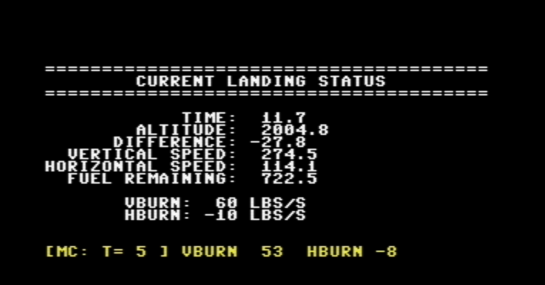

# Apollo Lunar Lander Simulator - Commodore 64


[](https://en.wikipedia.org/wiki/Commodore_64)
[](https://www.c64-wiki.com/wiki/BASIC)
[](https://www.c64-wiki.com/wiki/Joystick)
[](https://creativecommons.org/licenses/by-nc-sa/4.0/)

---

**Platforms:** Commodore 64/128  
**Languages:** Commodore BASIC v2.0  
**GitHub:** [Source Code & Binaries](https://github.com/GeorgeMcGinn/MoonLander/tree/main/commodore64)



Screenshot of the real-time version

---

## Documents
- **[C64: Lunar Lander Technical Details](Technical_Details.md)**
- **[C64: Apollo Lunar Lander Simulator for Commodore 64](Apollo_Lunar_Lander_Simulator_for_Commodore_64_A_Journey_from_Modern_Computing_to_1980s_Hardware.md)**
- **[Apollo Lunar Lander Simulator - Technical Developer Documentation (Real-Time Joystick Version)](C64_Technical_Docs-lunarlander.md)**


---
## Introduction

An authentic Apollo Lunar Module landing simulator for the Commodore 64 available in two versions: classic turn-based text input and real-time joystick control. Take command when the Apollo Guidance Computer fails at 7,500 feet above the lunar surface and manually pilot your spacecraft to a safe landing using realistic physics and Mission Control communication delays.

---

## Features

### Shared Features (Both Versions)

- **Realistic Physics**: Lunar gravity simulation with mass-variable spacecraft dynamics
- **Mission Control Simulation**: Authentic 6.6-second communication delay with physics-accurate timing
- **Abort Capability**: Emergency ascent to lunar orbit with delta-v calculations
- **Historical Accuracy**: Based on actual Apollo Lunar Module specifications
- **Full-Screen Display**: Complete 40×25 character screen with color coding

### Text-Based Version (Classic)

- **Turn-Based Input**: Strategic command input system (`duration,vburn,hburn`)
- **Keyboard Only**: No additional hardware required
- **Strategic Planning**: Calculate burns carefully between Mission Control updates
- **Classic Simulation**: Similar to original mainframe space simulations

### Real-Time Joystick Version (Advanced)

- **Real-Time Control**: Digital joystick control at 10 FPS with immediate response
- **Emergency Response**: Automatic 10× faster thrust response during dangerous descents
- **Live Dashboard**: Continuous flight data updates with altitude change tracking, including color status readings
- **Action Piloting**: Real-time decision making with physics constraints

---

## Requirements

### Hardware (Both Versions)

- Commodore 64 or 128 (in C64 mode)
- Disk drive, tape, or modern storage device
- TV or monitor (color recommended)

### Additional Requirements (Real-Time Version Only)

- **Digital joystick in Control Port 2** (required for real-time version)

### Memory (Both Versions)

- Standard 64KB configuration
- Uses approximately 6-8KB of program space

---

## Installing

### Text-Based Version

```
LOAD "MOONLANDER",8,1
RUN
```

### Real-Time Joystick Version

```
LOAD "LUNARLANDER",8,1
RUN
```

### From Tape

```
LOAD "MOONLANDER"      (Text version)
LOAD "LUNARLANDER"     (Real-time version)
RUN
```

### Emulators
Compatible with VICE, CCS64, Hoxs64, and C64 Forever. Real hardware provides more responsive joystick control for the real-time version.

Source for both versions was tested in both VICE and on a real C64C.

---

## Version Comparison

| Feature | Text-Based Version | Real-Time Version |
|---------|-------------------|-------------------|
| **Control Method** | Turn-based keyboard | Real-time joystick |
| **Update Rate** | Per-turn | 10 FPS continuous |
| **Emergency Response** | Manual calculation | Automatic 10× rates |
| **Mission Control** | Turn-based analysis using physics-accurate timing | Continuous physics-accurate timing |
| **Gameplay Style** | Strategic planning | Action piloting |
| **Hardware Required** | C64 only | C64 + Joystick |
| **Fuel Management** | Plan burns carefully | React to changing conditions |
| **Learning Curve** | Gentle, analytical | Steep, skill-based |
| **Replayability** | Strategy variation | Piloting skills variation |

---

## How to Play

### Objective (Both Versions)
Land safely with both vertical and horizontal speeds ≤ 5 ft/s for a perfect landing.

### Starting Conditions (Both Versions)

- **Altitude**: 7,500 ft
- **Vertical Speed**: 200-700 ft/s (random)
- **Horizontal Speed**: 50-200 ft/s (random)
- **Descent Fuel**: 1,500 lbs

### Text-Based Version Controls

**Input Format**: `duration,vburn,hburn`

- **Duration**: Time in seconds (max 20 per command)
- **VBurn**: Vertical thrust rate (0-250 lbs/s)
- **HBurn**: Horizontal thrust rate (-10 to +10 lbs/s)
- **Abort**: Enter negative duration (-1) to abort to orbit

**Example**: `10,50,-5` = 10 seconds, 50 lbs/s up, 5 lbs/s left

### Real-Time Joystick Version Controls

- **UP**: Decrease vertical thrust (1 lb/s normal, 5 lb/s when thrust >30 lb/s)
- **DOWN**: Increase vertical thrust (1 lb/s normal, 10 lb/s when speed ≥400 ft/s)
- **LEFT**: Thrust left to reduce rightward velocity
- **RIGHT**: Thrust right to reduce leftward velocity
- **FIRE BUTTON**: Abort to orbit (hold for 0.3 seconds)

### Strategy Tips

#### Text-Based Version

- Plan burns carefully between Mission Control updates
- Account for 6.6-second communication delay in calculations
- Use strategic planning approach with turn-based analysis

#### Real-Time Version

1. **Initial Phase**: Observe starting velocities and begin gentle corrections
2. **Emergency Phase**: Use 10× thrust increase when vertical speed ≥400 ft/s
3. **Mid-Flight**: Follow Mission Control guidance (remember 6.6-second delay)
4. **Final Approach**: Target 10-15 ft/s vertical for final descent
5. **Touchdown**: Fine-tune to ≤5 ft/s in both axes

### Color Coding System (Real-Time Version)
- **YELLOW**: Normal/Caution - default color
- **GREEN**: Optimal/Safe - target conditions
- **RED**: Danger/Critical - requires immediate attention

### Landing Results (Both Versions)

- **Perfect Landing**: Both speeds ≤ 5 ft/s
- **Good Landing**: Both speeds ≤ 15 ft/s
- **Crash Landing**: Impact speeds too high

---

## Known Issues

### Text-Based Version

- **Input Validation**: Check burn rate limits (vburn: 0-250, hburn: ±10)
- **Memory**: Reduce array sizes if memory errors occur

### Real-Time Joystick Version

- **Emulator Joystick Response**: May be less precise than real hardware
- **Abort Button**: Emulators may require longer button holds than 0.3 seconds
- **Analog Joysticks**: Not supported - only digital joysticks work properly

---

## Release Notes

### Version 1.0 (August 2025)

#### Text-Based Version

- Turn-based command input system
- Strategic planning gameplay
- Physics-accurate Mission Control timing
- Keyboard-only compatibility

#### Real-Time Joystick Version

- Real-time joystick control implementation
- Emergency response system with variable thrust rates
- Live dashboard with continuous updates
- Optimized for 1 MHz 6510 processor performance


### Version 1.5 (August 2025)

#### Real-Time Joystick Version
- Corrected floating-point issues (converted them to scaled integer processing)
- Improved thrust control for fine tuning abilities and enhanced emergency thrust capabilities (to simulate somewhat an analog joystick)
- Live dashboard now color-coded for optimal, normal and dangerous contitions
- Revamped vBurn and Hburn display to show NOMINAL conditions
- Added a splash screen

---

## License

Licensed under Creative Commons Attribution-NonCommercial-ShareAlike 4.0 International (CC BY-NC-SA 4.0)

You are free to share and adapt the work under these terms:
- **Attribution**: Credit the original author
- **NonCommercial**: Not for commercial use
- **ShareAlike**: Derivatives must use same license

**Author**: George McGinn (gjmcginn@icloud.com)

---
## Get Involved

The [GitHub Lunar Lander Repo](https://github.com/GeorgeMcGinn/MoonLander/tree/main/commodore64) welcomes:

- Bug reports 
- Pull requests for new features
- Documentation improvements
- Slick game GUI

---

## Additional Documents

The list/links below are to other documentation for this game and the science/info on Lunar landings and Apollo:

- **[A Modern Take on Lunar Landing: Comparing *moonLander* to Classic BASIC Games](documents/Comparing_moonLander_to_Classic_BASIC_Games.md)**
- **[Apollo Guidance Computer (AGC) Trajectory Calculation and Integration Methods](documents/Apollo_Guidance_Computer_Trajectory_Calculations.md)**
- **[Ground Control's Use of RK4](documents/Ground_Control's_Use_of_RK4.md)**
- **[Physics Analysis of the Apollo LEM Landing Simulation](documents/Physics_Analysis_of_the_Apollo_LEM_Simulation.md)**
- **[The Real LEM: A Two-Stage Design with Separate Fuel](documents/The_Real_LEM-A_Two-Stage_Design.md)**
- **[Understanding Mass Slugs, SI Units, and NASA's Standards](documents/Understanding_Slugs.md)**

---